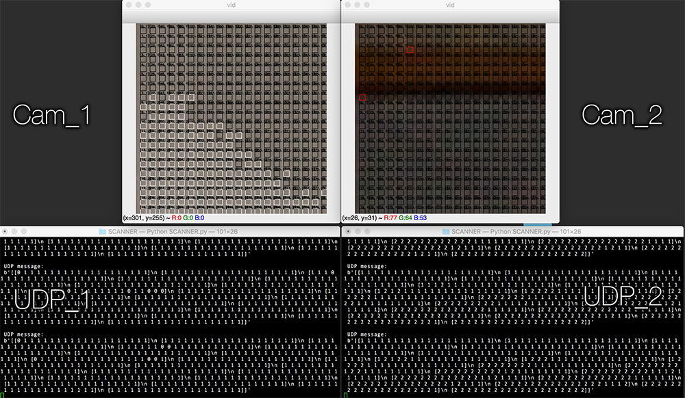

# CityScope Scanner [Python, OpenCV]

## Running

- Install packages manually or via `pip install -r requirements.txt`
- Run `KEYSTONE.py`
- Select 4 corners [up left, up right, bottom left, bottom right] of keystone region
- program will create `keystone.txt` and close
- Run `SCANNER.py` to start scanning and `UDP_LISTENER.py` to emulate UDP server listener

## Advanced

- Tweak UDP endpoints or scanned colors under `MODULES.py`
- Scan multiple cameras/keystones areas using different `.txt`

